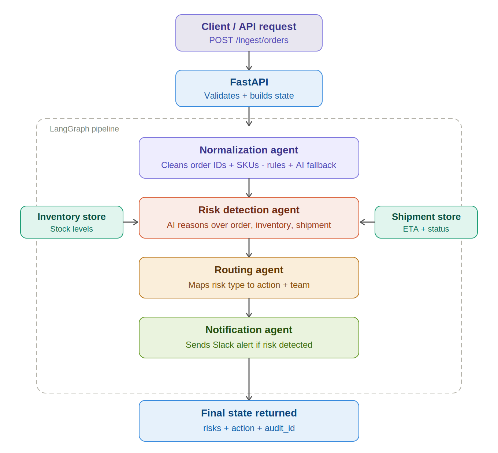
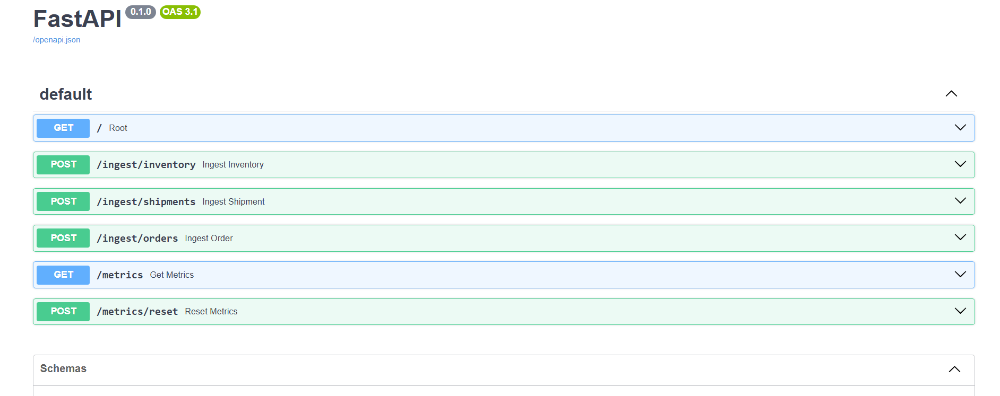
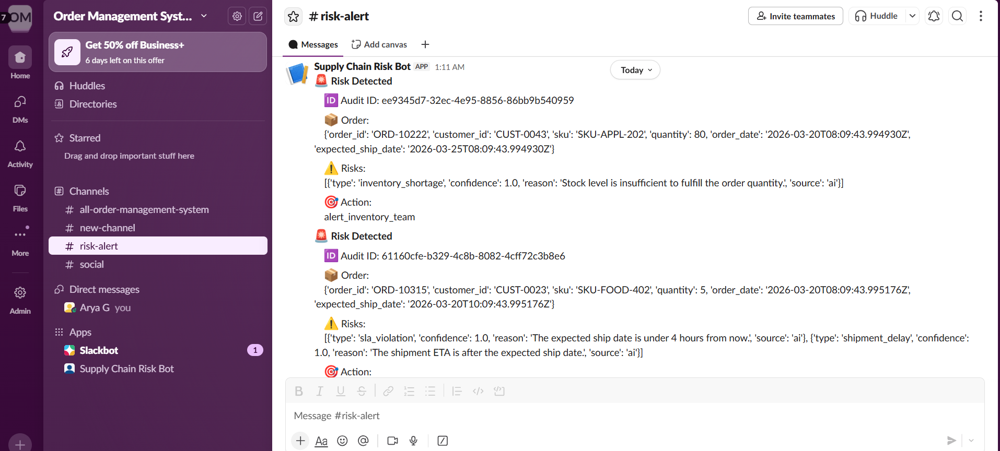
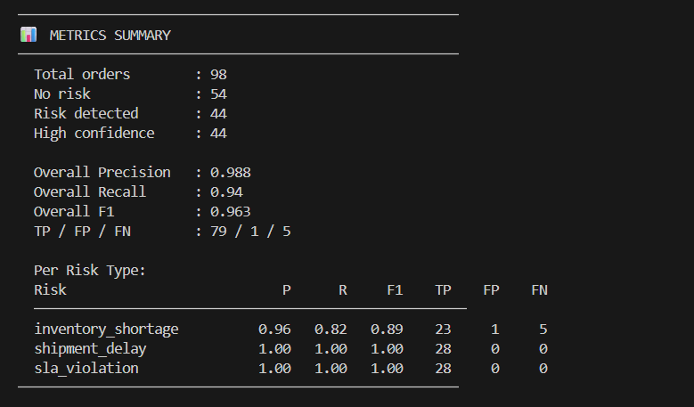

# Order Management System - Multi-Agent AI Pipeline (v1)

An AI-powered Order Management System built with FastAPI and LangGraph. Incoming orders pass through a pipeline of agents that normalize data, detect fulfillment risks using an LLM, route alerts to the right team, and fire Slack notifications in real time.

---

## Pipeline



```
Client Request
      |
      v
FastAPI - validates order, builds state
      |
      v  -- LangGraph pipeline ----------------------------------
      |
      |- Normalization Agent    cleans dirty order IDs and SKUs
      |                         (rules first, AI fallback for edge cases)
      |
      |- Risk Detection Agent   pure AI reasoning over order, inventory, shipment
      |                         detects: inventory_shortage, sla_violation,
      |                                  shipment_delay, fulfillment_delay
      |
      |- Routing Agent          maps each risk type to an action and team
      |
      |- Notification Agent     sends Slack alert if any risk detected
      |
      v
Final state returned - risks, action, audit_id
```

---

## Screenshots

### FastAPI - Interactive Docs


### Slack - Risk Alerts


---

## Tech Stack

| Layer | Technology |
|---|---|
| API | FastAPI |
| Pipeline | LangGraph |
| LLM | OpenAI GPT-4o-mini |
| Notifications | Slack Webhooks |
| Storage | In-memory (dev) |
| Test Data | Custom synthetic data generator |

---

## Project Structure

```
oms-multi-agent/
|
|-- main.py                      # FastAPI app - routes, metrics
|-- run_demo.py                  # Sends synthetic data, prints evaluation metrics
|-- generate_data.py             # Synthetic data generator with ground truth labels
|-- synthetic_data.json          # Generated test dataset (98 orders, 9 scenarios)
|
|-- agents/
|   |-- normalization_agent.py   # Cleans order_id and SKU formats
|   |-- risk_agent.py            # AI-powered risk detection
|   |-- routing_agent.py         # Maps risks to actions
|   |-- notification_agent.py    # Sends Slack alerts
|
|-- graph/
|   |-- pipeline.py              # LangGraph graph definition
|
|-- schemas/
|   |-- state.py                 # FulfillmentState - shared pipeline state
|   |-- events.py                # Pydantic models: OrderEvent, InventoryEvent, ShipmentEvent
|
|-- services/
    |-- state_store.py           # In-memory store for inventory and shipments
    |-- model_service.py         # OpenAI API wrapper
```

---

## Setup

**1. Clone the repo**
```bash
git clone https://github.com/AryaGaikwad/Order-Management-System.git
cd Order-Management-System
```

**2. Install dependencies**
```bash
pip install -r requirements.txt
```

**3. Create a `.env` file**
```
OPENAI_API_KEY=your_openai_api_key
SLACK_WEBHOOK_URL=your_slack_webhook_url
```

Slack is optional. If `SLACK_WEBHOOK_URL` is not set, notifications are silently skipped and everything else still works.

**4. Generate synthetic test data**
```bash
python generate_data.py
```

---

## Running

**Start the server**
```bash
uvicorn main:app --reload
```

**Run the full demo**
```bash
python run_demo.py
```

Sends all 98 synthetic orders through the pipeline and prints evaluation metrics at the end.

**Browse the API**
```
http://localhost:8000/docs
```

---

## API Endpoints

| Method | Endpoint | Description |
|---|---|---|
| `GET` | `/` | Health check |
| `POST` | `/ingest/orders` | Process an order through the pipeline |
| `POST` | `/ingest/inventory` | Store an inventory record |
| `POST` | `/ingest/shipments` | Store a shipment record |
| `GET` | `/metrics` | Precision, recall, F1 per risk type |
| `POST` | `/metrics/reset` | Reset all metric counters |

---

## Risk Detection

The AI agent receives pre-computed structured context:

```json
{
  "order": {
    "sku": "SKU-APPL-202",
    "quantity_ordered": 150,
    "expected_ship_date": "2.5 hours from now"
  },
  "inventory": {
    "stock_level": 30,
    "stock_vs_order": "INSUFFICIENT (30 < 150)"
  },
  "shipment": {
    "eta_vs_expected": "LATE - arrives 3 days after expected"
  }
}
```

And returns all detected risks with confidence and source:

```json
{
  "risks": [
    { "type": "inventory_shortage", "confidence": 1.0, "reason": "stock of 30 is below ordered quantity of 150", "source": "ai" },
    { "type": "sla_violation",      "confidence": 1.0, "reason": "only 2.5 hours until expected ship date",      "source": "ai" },
    { "type": "shipment_delay",     "confidence": 0.9, "reason": "shipment arrives 3 days after expected date",  "source": "ai" }
  ]
}
```

Every risk is tagged `"source": "ai"` so the AI's contribution is measurable.

---

## Routing

| Risk | Action | Team alerted |
|---|---|---|
| `inventory_shortage` | `alert_inventory_team` | Inventory |
| `shipment_delay` | `alert_logistics_team` | Logistics |
| `sla_violation` | `alert_customer_success` | Customer Success |
| `fulfillment_delay` | `alert_operations_team` | Operations |
| `unknown_risk` | `review_required` | Manual review |

---

## Evaluation Metrics

After running `run_demo.py`, metrics are available at `GET /metrics`:

```json
{
  "summary": { "total_requests": 98, "no_risk": 40, "risk_detected": 58 },
  "overall": { "precision": 0.96, "recall": 0.94, "f1": 0.95 },
  "per_risk_type": {
    "inventory_shortage": { "precision": 1.00, "recall": 0.82, "f1": 0.90 },
    "shipment_delay":     { "precision": 0.95, "recall": 1.00, "f1": 0.97 },
    "sla_violation":      { "precision": 1.00, "recall": 1.00, "f1": 1.00 }
  }
}
```

Metrics compare AI predictions against `expected_risks` ground truth labels in `synthetic_data.json`.




---

## Test Data Scenarios

98 orders across 9 scenarios with guaranteed ground truth labels:

| Scenario | Count | Expected Risks |
|---|---|---|
| `normal` | 35 | none |
| `inventory_shortage` | 12 | inventory_shortage |
| `shipment_delay` | 12 | shipment_delay + sla_violation |
| `sla_breach` | 8 | sla_violation + shipment_delay |
| `high_risk` | 8 | inventory_shortage + sla_violation + shipment_delay |
| `competing_orders` | 8 | inventory_shortage |
| `post_restock` | 5 | none |
| `dirty_data` | 8 | none |
| `duplicate` | 2 | none |

---
